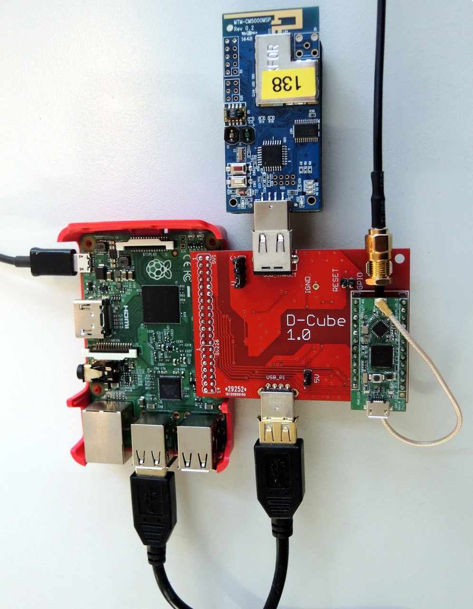
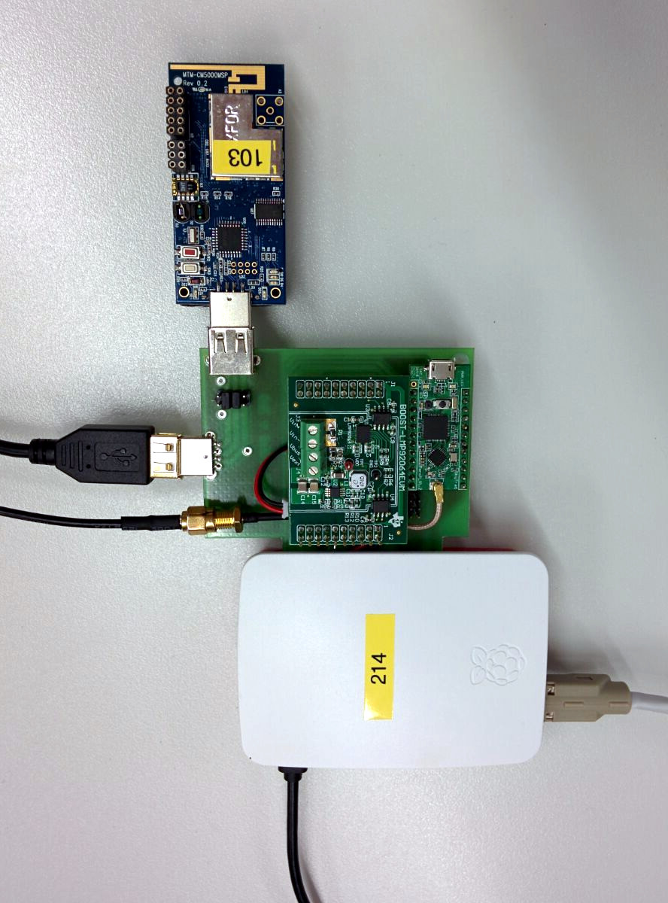

# D-Cube Design #

D-Cube is published as open source hardware under [CC-BY-SA](license.md) ([online](https://creativecommons.org/licenses/by-sa/4.0/deed.en)).
D-Cube is a low-cost tool that allows to accurately profile the end-to-end delay, reliability, and power consumption, of low-power wireless sensor nodes, as well as to graphically visualize their evolution in real-time.
This tool has been used to set-up the EWSN 2016, 2017 and 2018 dependability competitions.
* [EWSN 2016 Dependability Competition (Graz, Austria)](http://ewsn2016.tugraz.at/cms/index.php?id=49)  
* [EWSN 2017 Dependability Competition (Uppsala, Sweden)](http://www.ewsn2017.org/dependability-competition1.html)
* [EWSN 2018 Dependability Competition (Madrid, Spain)](https://ewsn2018.networks.imdea.org/competition-program.html)

A scientific paper about D-Cube was published at the 14th International Conference on Embedded Wireless Systems and Networks (EWSN), and is available [here](http://www.carloalbertoboano.com/documents/boano17competition.pdf).

## D-Cube Hardware ##
The design files in this repository where used to fabricate the current iteration of D-Cube. The GPS module used is a Navspark-GL. For the complementary MOSFET a NTJD4105CT2G was chosen in the final design.

### The current version of the hardware (2.1) ###
The current version of the hardware supports multiple bi-directional GPIOs via isolation. It also adds support for PoE via a PEM1305 module. The aging navspark has been replaced with a more generic ublox neo footprint.

### The orignal version of the hardware (1.0) ###

### The prototype used during EWSN 2016 ###

## D-Cube Software ##
The Software consists of two parts
* A task reading the ADC into a FIFO (on top of a real-time Linux kernel)
* A task reading the FIFO and writing it to the database (InfluxDB)

D-Cube contains a power switch circuit which controls the power before the DCDC isolator. A high signal on GPIO23 is required for the ADC and the target to be supplied with power. The gpio.sh file contains an example for this.

### Real-Time Linux ###
We used https://github.com/emlid/linux-rt-rpi but others should work fine

### Visualisation ###
InfluxDB has many frontends available, we used grafana (http://grafana.org/)
